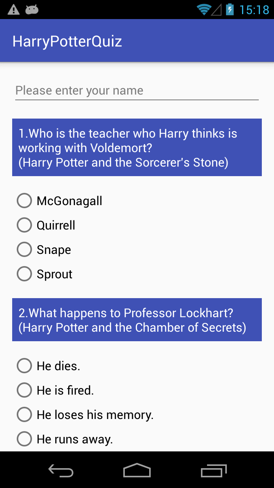
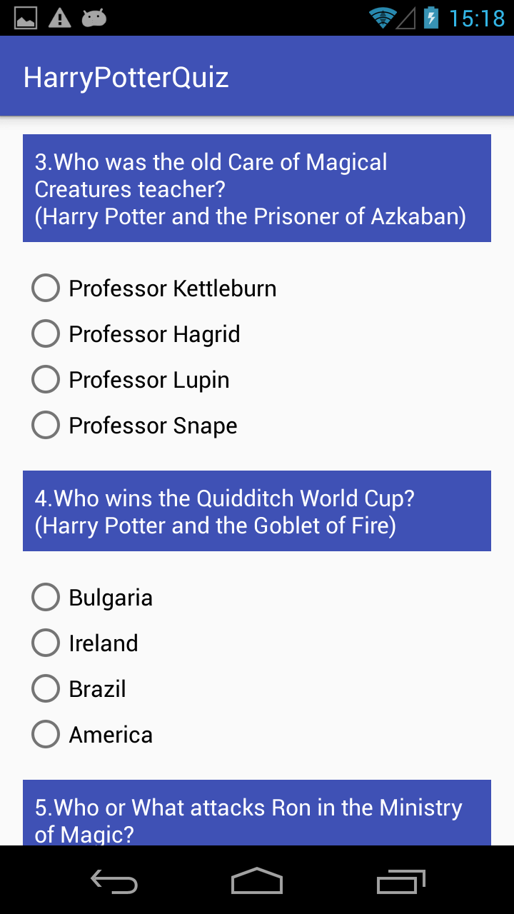
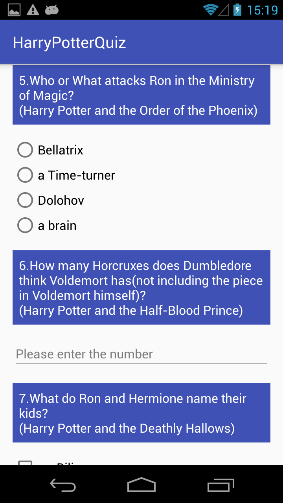
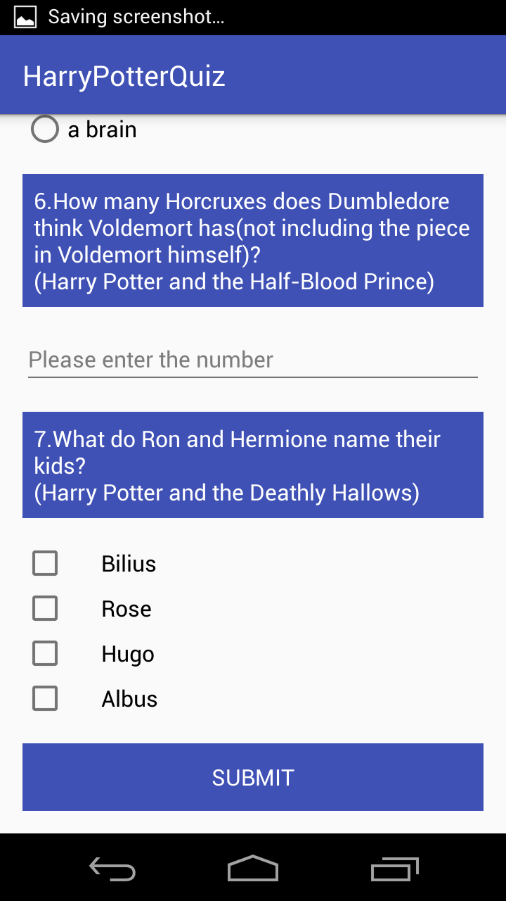
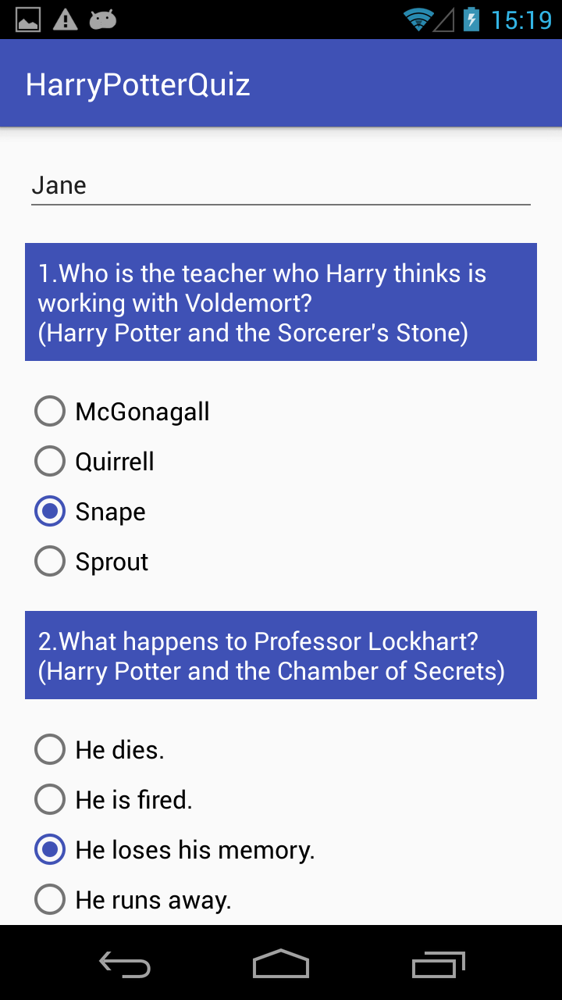
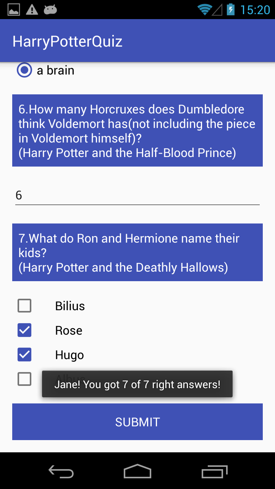
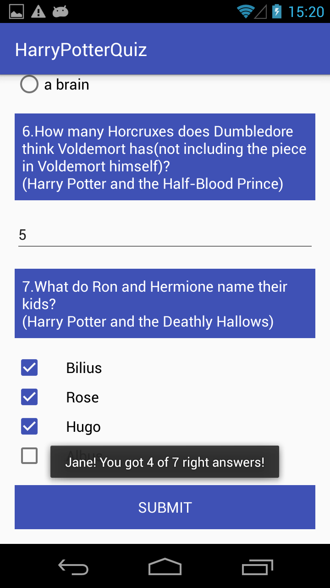
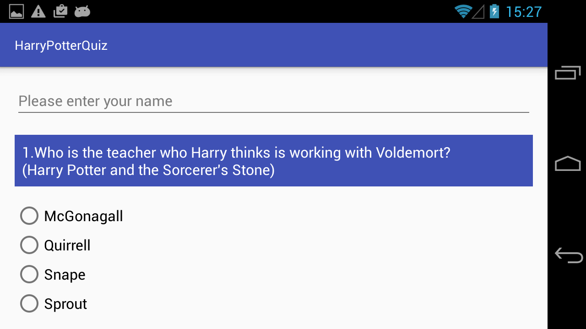
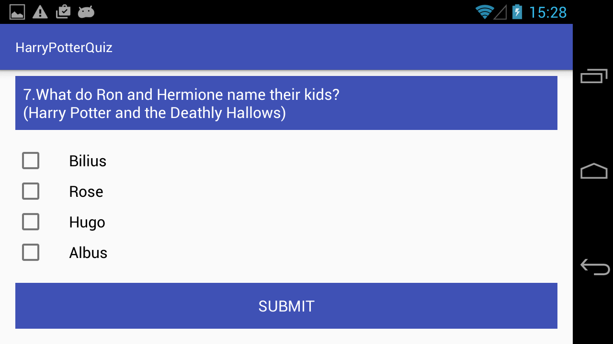

# HarryPotterQuiz
Quiz for Harry Potter lovers(my favorite). 

Started reusing customized styles(e.g. styling questions' texts). 

Highlight is logic. More logic in the java code now.

# App ScreenShots
        

 
